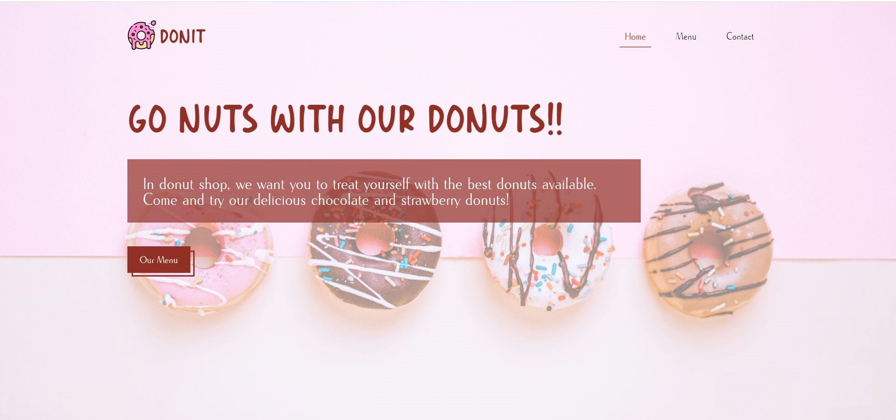
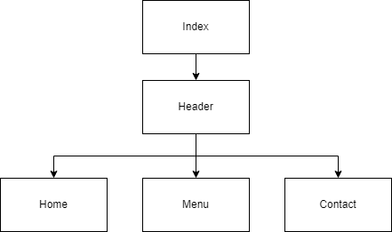

# Restaurant Page

This is a solution to the [Restaurant Page Project from the JavaScript Course from The Odin Project](https://www.theodinproject.com/lessons/node-path-javascript-restaurant-page).

The website consists of 3 pages

- Home
- About
- Contact

These pages can be changed using the buttons in the header navbar.

# Live Link

- Live Site URL: [Live Link](https://the-odin-project-mlvh.vercel.app/)

## Table of contents

- [Overview](#overview)
  - [Goals](#goals)
  - [Screenshot](#screenshot)
- [My process](#my-process)
  - [Built with](#built-with)
  - [Component diagram](#component-diagram)
  - [What I learned](#what-i-learned)
  - [Improvements](#improvements)
- [Resources used](#resources-used)

## Overview

### Goals

- Get comfortable using webpack and npm.
- Use JavaScript to dynamically generate all page content

### Screenshot



## My process

### Built with

- HTML
- CSS
- JavaScript
- Webpack

### Component diagram

The below diagram shows how the different JavaScript files are linked in this project:



### What I learned

I wanted to make the header common and only change the page specific content. For this, I used callbacks. I knew about callbacks but through this project, I now have a much better understanding of callbacks.

I used the callback function inside Header component to change page content, the code for is shown below:

```
// index.js
const ChangePageContent = () => {
  content.innerHTML = "";
  navItems.forEach((item) => {
    if (item.active === true) {
      const pageName = item.name;
      switch (pageName) {
        case "Home":
          content.appendChild(Home());
          break;
        case "Menu":
          content.appendChild(Menu());
          break;
        case "Contact":
          content.appendChild(Contact());
          break;
      }
    }
  });
  root.appendChild(content);
};
```

```
// Header.js
const ChangePage = (e, navItemsArr, ChangePageContent) => {
  if (e.target.classList.contains("tab-btn")) {
    ...
    ChangePageContent();
  }
};

```

### Improvements

- Make the website responsive

## Resources used

- <a href="https://www.flaticon.com/free-icons/doughnut" title="doughnut icons">Doughnut icons created by Freepik - Flaticon</a>

- <a href="https://unsplash.com/photos/F71ZHHBYs3w?utm_source=unsplash&utm_medium=referral&utm_content=creditShareLink">Donut background image</a>

- <a href="https://coder-coder.com/background-image-opacity/">How to change background-image opacity in CSS without affecting text | HTML/CSS</a>

- Photo by <a href="https://unsplash.com/@olamishchenko?utm_source=unsplash&utm_medium=referral&utm_content=creditCopyText">Ola Mishchenko</a> on <a href="https://unsplash.com/photos/XjyH9_hXEyA?utm_source=unsplash&utm_medium=referral&utm_content=creditCopyText">Unsplash</a>

- Photo by <a href="https://unsplash.com/@fahim_?utm_source=unsplash&utm_medium=referral&utm_content=creditCopyText">Fahim mohammed</a> on <a href="https://unsplash.com/photos/EumgKI11Hns?utm_source=unsplash&utm_medium=referral&utm_content=creditCopyText">Unsplash</a>

- Photo by <a href="https://unsplash.com/@stri_khedonia?utm_source=unsplash&utm_medium=referral&utm_content=creditCopyText">Alice Pasqual</a> on <a href="https://unsplash.com/photos/1qubXlkKnSM?utm_source=unsplash&utm_medium=referral&utm_content=creditCopyText">Unsplash</a>

- Map taken from <a href="https://www.openstreetmap.org/">Open Street Map</a>

- Callback function <a href="https://www.youtube.com/shorts/-6qRM2H2hKw">Callback Functions Youtube shorts video by Uma Abu</a>
